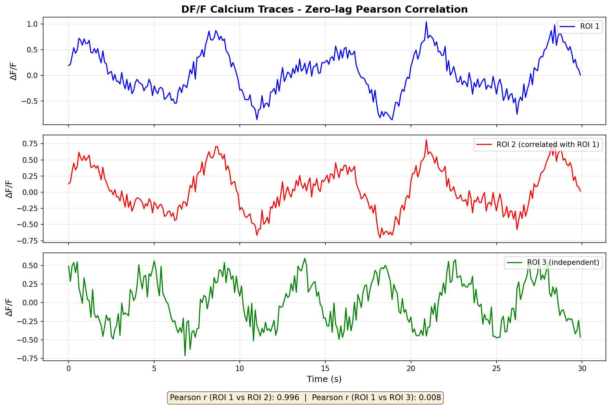
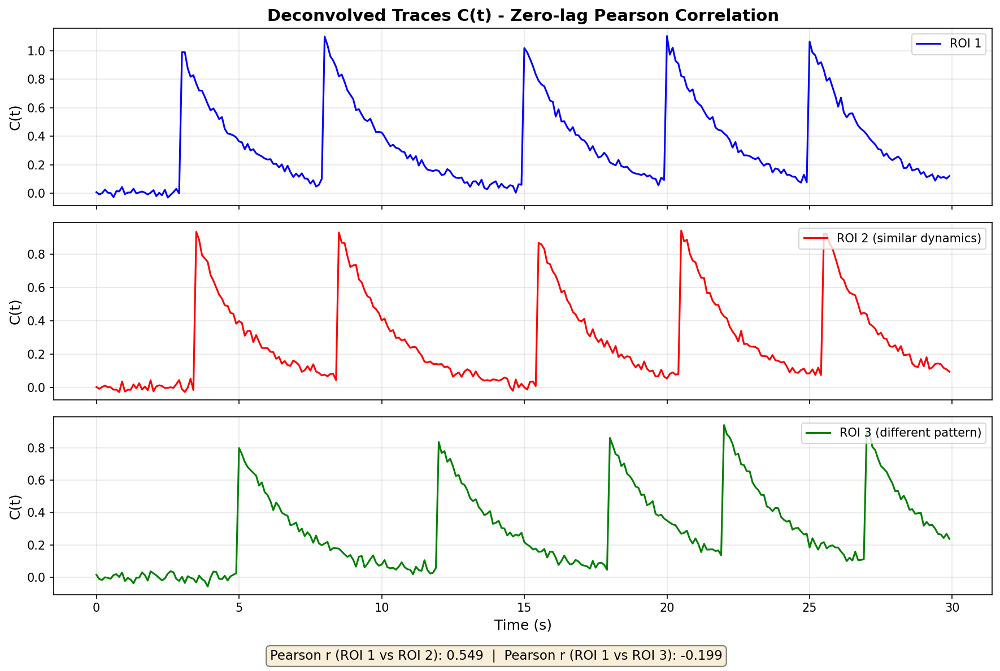
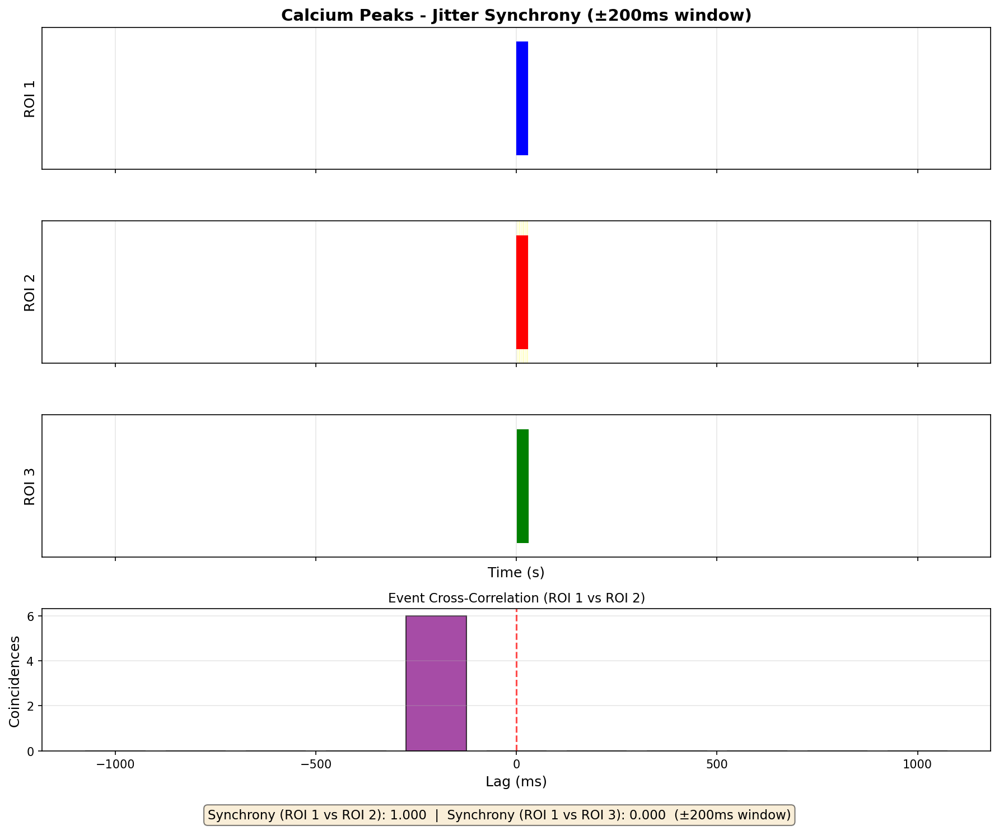
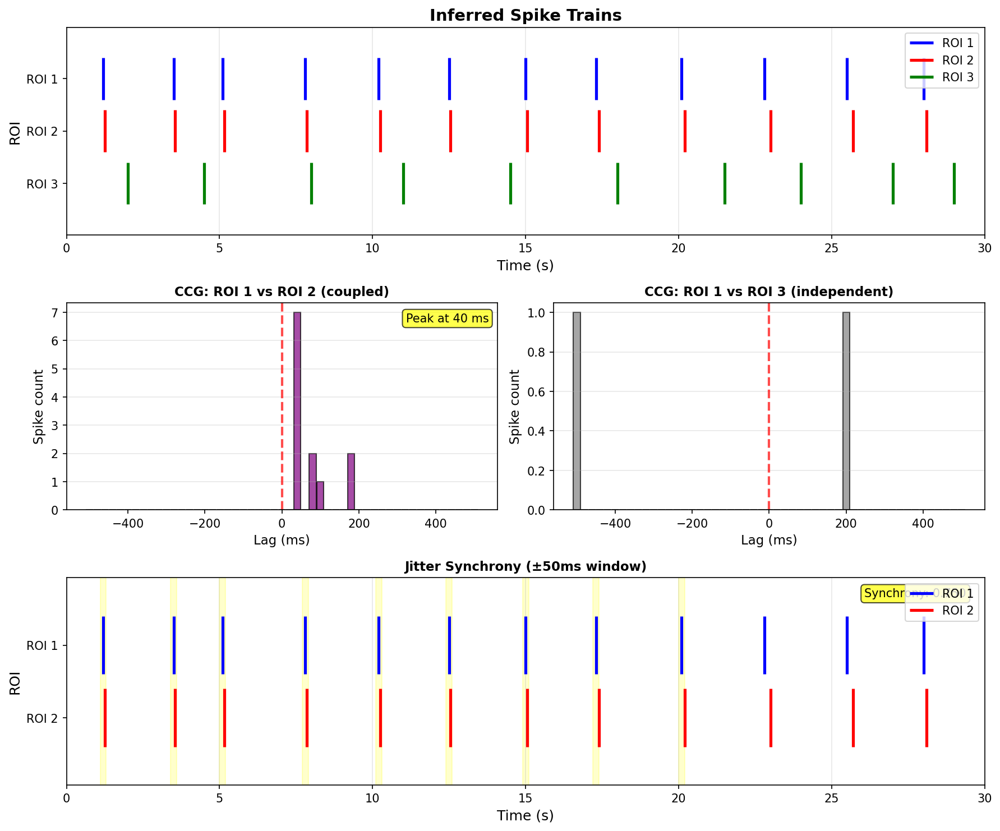
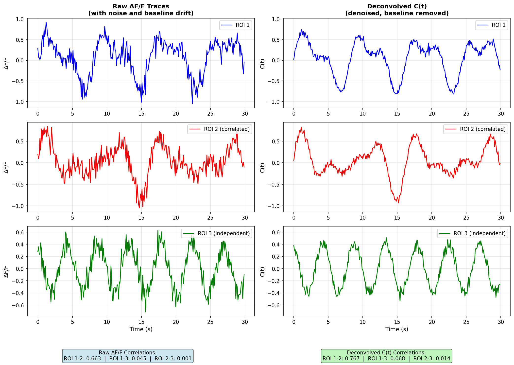

# Calcium Imaging Correlation and Synchrony Metrics Guide

This guide explains which metrics to use for different types of calcium imaging data, with visual examples showing what each metric measures.

---

## Table of Contents

1. [ΔF/F Calcium Traces (Raw Fluorescence)](#1-Δff-calcium-traces-raw-fluorescence)
2. [Deconvolved ΔF/F Traces (OASIS C(t))](#2-deconvolved-Δff-traces-oasis-ct)
3. [Calcium Peaks (Event Detection)](#3-calcium-peaks-event-detection)
4. [Inferred Spikes (Thresholded OASIS s(t))](#4-inferred-spikes-thresholded-oasis-st)
5. [Summary Table](#summary-table)

---

## 1. ΔF/F Calcium Traces (Raw Fluorescence)

### Recommended Metric: **Zero-lag Pearson Correlation**

### What it measures

Zero-lag Pearson correlation measures **slow co-fluctuations** between neurons:

- Whether two ROIs tend to increase or decrease together
- Similarity of ΔF/F trace shapes over time
- **NOT timing or causality** — only covariation

### Why this metric?

Calcium traces are inherently slow (hundreds of milliseconds to seconds), representing the integrated activity of neurons. Because of this temporal blurring, precise timing information is lost. Correlation is the only meaningful measure for continuous, slow-varying signals.

### Visual Example

### Interpretation

- **High positive correlation (r ≈ 0.8-1.0)**: Both traces consistently rise and fall together (see ROI 1 vs ROI 2 above)
- **Near-zero correlation (r ≈ 0)**: Traces fluctuate independently (see ROI 1 vs ROI 3 above)
- **Negative correlation (r < 0)**: When one trace rises, the other tends to fall

### When to use

✅ Use for:

- Measuring ensemble coactivity between neurons
- Identifying functional connectivity at the population level
- Comparing global activity patterns across brain regions

❌ Avoid:

- Trying to infer precise timing relationships
- Measuring synchrony (use event-based data instead)
- Detecting causality or directionality

---

## 2. Deconvolved ΔF/F Traces (OASIS C(t))

### Recommended Metric: **Zero-lag Pearson Correlation**

### What it measures

C(t) represents a **denoised, sharpened version** of the raw ΔF/F trace:

- Removes slow baseline drift
- Sharpens calcium transients
- Still a continuous signal, **not discrete events**

### Why this metric?

While deconvolution improves signal quality and temporal resolution, C(t) remains a continuous trace. It does **not** restore spike-level timing precision. Therefore, correlation is still the appropriate metric.

### Visual Example

### Interpretation

- **High correlation**: ROIs show similar patterns of transient activity
- **Low/zero correlation**: Independent dynamics
- The correlation is often **cleaner** than raw ΔF/F because noise is reduced

### When to use

✅ Use for:

- Improved correlation estimates compared to raw ΔF/F
- Analyzing shared transient dynamics after noise removal
- Better signal-to-noise ratio for functional connectivity analysis

❌ Avoid:

- Synchrony metrics (timing is still imprecise)
- Assuming spike-level temporal precision

---

## 3. Calcium Peaks (Event Detection)

Calcium peaks represent **approximate event times** detected from ΔF/F or C(t) traces. They have inherent temporal jitter of ~100-300 ms, so only lag-tolerant metrics are appropriate.

### Recommended Metrics

#### A. **Event Cross-Correlation (with lag tolerance)**

### What it measures

Whether peaks from two ROIs tend to occur **near each other in time**, allowing for temporal jitter:

- Rough temporal lag relationships
- Strength of co-activation
- Which ROI tends to activate first (coarse temporal ordering)

#### B. **Jitter Synchrony (±window)**

### What it measures

Whether two ROIs have **significantly more co-occurring events than expected by chance**:

- Allows a time tolerance window (e.g., ±200 ms)
- Returns a synchrony score between 0 and 1
- Robust to temporal jitter inherent in calcium imaging

### Visual Example

**Yellow bands** show the jitter window around ROI 1 peaks. When ROI 2 has a peak within this window, the events are considered synchronous.

The **cross-correlogram** (bottom panel) shows how many coincident events occur at different time lags. A peak near zero lag indicates strong synchrony.

### Interpretation

- **High synchrony (>0.7)**: ROIs frequently activate together within the time window
- **Moderate synchrony (0.3-0.7)**: Some co-activation, but also independent events
- **Low synchrony (<0.3)**: ROIs activate independently

### When to use

✅ Use for:

- Detecting functional coupling between neurons
- Identifying co-active neural assemblies
- Measuring ensemble synchronization (with appropriate jitter tolerance)

❌ Avoid:

- **Zero-lag Pearson correlation** on peak times (discrete events, not continuous signals)
- Assuming millisecond-precision timing
- Small jitter windows (<50 ms) — not supported by calcium imaging resolution

---

## 4. Inferred Spikes (Thresholded OASIS s(t))

Inferred spikes are **discrete spike-like events** with partially restored temporal structure. Here, both correlation **and** synchrony metrics are appropriate.

### Recommended Metrics

#### A. **Zero-lag Pearson Correlation (on spike trains)**

### What it measures

Whether two neurons tend to be **active in the same time bins**:

- Ensemble coactivity
- Population coupling
- Shared participation in network states

#### B. **Max-Lag Cross-Correlogram (CCG)**

### What it measures

- **Connection strength**: Height of the CCG peak
- **Preferred temporal lag**: Position of the peak
- **Directionality**: Which neuron fires first (positive vs. negative lag)

#### C. **Jitter Synchrony (±window)**

### What it measures

Precise synchrony between spike trains within a narrow time window (e.g., ±50 ms):

- More robust than plain CCG
- Returns a normalized synchrony score [0, 1]
- Best measure of precise co-firing

### Visual Example

**Top panel**: Raster plot showing spike times for three ROIs.

**Middle panels**: Cross-correlograms (CCG) showing the number of spike coincidences at different time lags. A peak at positive lag indicates ROI 1 tends to fire before ROI 2.

**Bottom panel**: Jitter synchrony with a ±50 ms window. Yellow bands highlight synchronous spike pairs.

### Interpretation

#### Pearson Correlation

- **High (r > 0.5)**: Neurons frequently fire in the same time bins
- **Low (r ≈ 0)**: Independent firing patterns

#### CCG

- **Peak at lag 0**: Synchronous firing
- **Peak at positive lag (+X ms)**: ROI 1 leads ROI 2 by X ms
- **Peak at negative lag (-X ms)**: ROI 2 leads ROI 1 by X ms
- **Flat CCG**: No temporal relationship

#### Jitter Synchrony

- **Score > 0.7**: Strong synchrony
- **Score 0.3-0.7**: Moderate synchrony
- **Score < 0.3**: Weak/no synchrony

### When to use

✅ Use for:

- Detailed analysis of spike timing relationships
- Detecting monosynaptic connections (narrow CCG peaks)
- Polysynaptic pathways (broader CCG peaks)
- Precise synchrony analysis

❌ Avoid:

- Overinterpreting millisecond-precision (calcium imaging has limits)
- Ignoring the jitter inherent in spike inference

---

## Summary Table

| Signal Type                   | Recommended Correlation              | Recommended Synchrony         | ❌ Avoid                          |
|-------------------------------|--------------------------------------|-------------------------------|-----------------------------------|
| **ΔF/F Traces**               | Zero-lag Pearson                     | None (inappropriate)          | Jitter synchrony, event metrics   |
| **Deconvolved C(t)**          | Zero-lag Pearson                     | None (inappropriate)          | Timing-based synchrony            |
| **Calcium Peaks**             | Event Cross-Correlation (with lag)   | Jitter synchrony (±window)    | Zero-lag Pearson correlation      |
| **Inferred Spikes**           | Pearson, Max-lag CCG                 | Jitter synchrony, CCG         | Assuming perfect spike precision  |

---

## Key Principles

1. **Match the metric to the signal type**: Continuous traces need correlation; discrete events can use synchrony.

2. **Respect temporal resolution**: Calcium imaging is inherently slow (~100-300 ms jitter). Don't overinterpret millisecond-level precision.

3. **Use lag tolerance**: For event-based metrics (peaks, spikes), always allow for temporal jitter.

4. **Correlation ≠ Causality**: High correlation shows co-fluctuation, not directionality. Use CCG or other causal inference methods for directionality.

5. **Deconvolution helps but has limits**: C(t) and s(t) improve temporal precision but don't fully restore spike timing.

## Functional Connectivity in Calcium Imaging

Functional connectivity describes statistical relationships between neurons based on their activity patterns.
In calcium imaging, this is typically defined as:

The degree to which two neurons’ activity traces co-fluctuate over time.

This is very different from:
• Structural connectivity (physical synapses or projections)
• Effective connectivity (causal influence or directional flow)
• Synchrony (event-based coactivation in small time windows)

Functional connectivity does NOT imply causality.
Instead, it captures co-activity patterns, reflecting:
• common input
• shared network state
• ensemble membership
• global rhythms / slow population dynamics
• local circuit activation

### Why Pearson Correlation Is the Dominant Metric

Calcium signals (ΔF/F or deconvolved C(t)) are slow, continuous traces:
• Rise times: 50–200 ms
• Decay times: hundreds of ms
• Frame rate (e.g., 10–30 Hz): coarse temporal sampling
• Underlying spikes cannot be recovered with precise timing

Therefore, timing-based measures (jitter synchrony, CCG, causality) are not appropriate for continuous calcium traces.

Instead, the most robust measure is:

Zero-lag Pearson Correlation

r = \frac{\sum_t (x_t-\bar x)(y_t-\bar y)}{\sigma_x \sigma_y}

What Pearson correlation captures:
• similarity of trace shape
• coactivation strength
• shared network dynamics
• whether two neurons tend to be active “together” (in a slow sense)

What it does not capture:
• who activates first
• time-order relationships
• synaptic connectivity
• precise synchrony

### Deconvolved DF/F vs Raw DF/F for Functional Connectivity

Raw ΔF/F
• higher noise
• baseline drift
• slower kinetics
• correlation often inflated by autofluorescence or neuropil

Deconvolved DF/F (C(t))
• denoised
• baseline removed
• sharper transients
• correlation structure reflects true neural coactivity more faithfully

Therefore, the recommended default metric for functional connectivity is:

Zero-lag Pearson correlation on deconvolved DF/F traces
(also known as “functional connectivity correlation”)

This is what most calcium-imaging functional connectivity papers report.

⸻

### Visual Example: Functional Connectivity From DF/F and C(t)

**Left column**: Raw ΔF/F traces show noise, baseline drift, and some correlation inflation.

**Right column**: Deconvolved C(t) traces are cleaner, with baseline removed and sharper transients.

Interpretation
• ROI 1 and ROI 2 show similar dynamics → high functional connectivity
• ROI 3 behaves independently → low functional connectivity
• C(t) correlations are typically more accurate than raw ΔF/F correlations

Functional connectivity graph = nodes = neurons, edges = high-correlation pairs.

Lower threshold → denser graph
Higher threshold → sparse graph (hubs and modules)

### When Functional Connectivity Is Appropriate

✔ Use it for:
• overall network structure
• clustering neurons by co-activity
• identifying functional modules / ensembles
• tracking network evolution during learning, stimulation, pathology
• low-frame-rate recordings (≤30 Hz)

❌ Avoid using functional connectivity for:
• directionality or causality
• spike-timing inference
• synaptic mapping
• rapid signaling events (millisecond scale)

⸻

## Summary

Functional connectivity:
• is correlation-based
• works on continuous traces
• best for DF/F and deconvolved DF/F
• reveals coactivation structure, not causal flow
• forms the basis for most network graphs in calcium imaging research
